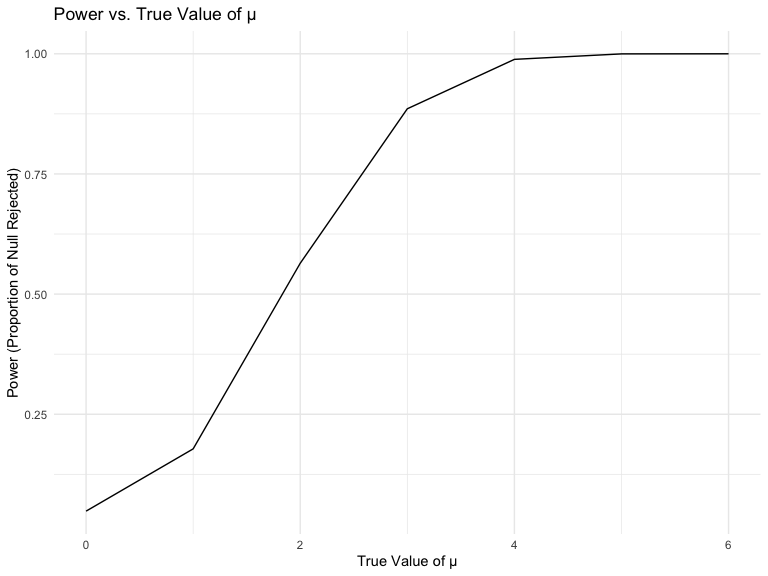
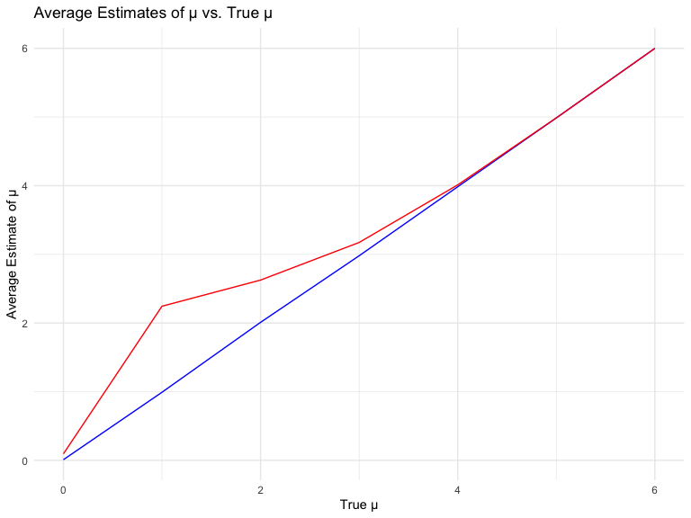

Homework 5
================
Wen Dai
2023-11-15

## Problem 1

For this problem, we are interested in data gathered and made public by
*The Washington Post* on homicides in 50 large U.S. cities. The code
chunk below imports and cleans the data.

``` r
homicide_df = 
  read_csv("data1/homicide-data.csv", na = c("", "NA", "Unknown")) %>%
  mutate(
    city_state = str_c(city, state, sep = ", "),
    resolution = case_when(
      disposition == "Closed without arrest" ~ "unsolved",
      disposition == "Open/No arrest"        ~ "unsolved",
      disposition == "Closed by arrest"      ~ "solved"
    )
  ) %>% 
  filter(city_state != "Tulsa, AL") 
```

    ## Rows: 52179 Columns: 12
    ## ── Column specification ────────────────────────────────────────────────────────
    ## Delimiter: ","
    ## chr (8): uid, victim_last, victim_first, victim_race, victim_sex, city, stat...
    ## dbl (4): reported_date, victim_age, lat, lon
    ## 
    ## ℹ Use `spec()` to retrieve the full column specification for this data.
    ## ℹ Specify the column types or set `show_col_types = FALSE` to quiet this message.

The resulting dataframe has 52178 entries, on variables that include the
victim name, race, age, and sex; the date the homicide was reported; and
the location of the homicide. In cleaning, I created a `city_state`
variable that includes both city and state, and a `resolution` variable
to indicate whether the case was closed by arrest. I also excluded one
entry in Tulsa, AL, which is not a major US city and is most likely a
data entry error.

In the next code chunk, I group within cities and summarize to produce
the total number of homicides and the number that are solved.

``` r
city_homicide_df = 
  homicide_df %>% 
  select(city_state, disposition, resolution) %>% 
  group_by(city_state) %>% 
  summarize(
    hom_total = n(),
    hom_unsolved = sum(resolution == "unsolved"))
```

Focusing only on Baltimore, MD, I can use the `prop.test` and
`broom::tidy` functions to obtain an estimate and CI of the proportion
of unsolved homicides in that city. The table below shows those values.

``` r
bmore_test = 
  prop.test(
    x = filter(city_homicide_df, city_state == "Baltimore, MD") %>% pull(hom_unsolved),
    n = filter(city_homicide_df, city_state == "Baltimore, MD") %>% pull(hom_total)) 

broom::tidy(bmore_test) %>% 
  knitr::kable(digits = 3)
```

| estimate | statistic | p.value | parameter | conf.low | conf.high | method                                               | alternative |
|---------:|----------:|--------:|----------:|---------:|----------:|:-----------------------------------------------------|:------------|
|    0.646 |   239.011 |       0 |         1 |    0.628 |     0.663 | 1-sample proportions test with continuity correction | two.sided   |

Building on this code, I can use functions in the `purrr` package to
obtain estimates and CIs for the proportion of unsolved homicides in
each city in my dataset. The code below implements this analysis.

``` r
test_results = 
  city_homicide_df %>% 
  mutate(
    prop_tests = map2(hom_unsolved, hom_total, \(x, y) prop.test(x = x, n = y)),
    tidy_tests = map(prop_tests, broom::tidy)) %>% 
  select(-prop_tests) %>% 
  unnest(tidy_tests) %>% 
  select(city_state, estimate, conf.low, conf.high) %>% 
  mutate(city_state = fct_reorder(city_state, estimate))
```

Finally, I make a plot showing the estimate (and CI) of the proportion
of unsolved homicides in each city.

``` r
test_results %>% 
  mutate(city_state = fct_reorder(city_state, estimate)) %>% 
  ggplot(aes(x = city_state, y = estimate)) + 
  geom_point() + 
  geom_errorbar(aes(ymin = conf.low, ymax = conf.high)) + 
  theme(axis.text.x = element_text(angle = 90, hjust = 1))
```


This figure suggests a very wide range in the rate at which homicides
are solved – Chicago is noticeably high and, given the narrowness of the
CI, likely is the location of many homicides.

# Problem 2

Part I: Create a tidy data frame containing data from all participants,
including the subject ID, arm, and observations over time:

- step 1: Use list.files function to create a dataframe that containing
  all file names

- step 2: Iterate over file names and read in data for each subject
  using purrr::map and saving the result as a new variable in the
  dataframe.

- Step 3: I tidied the result; manipulate file names to include control
  arm and subject ID, make sure weekly observations are “tidy”, and do
  any other tidying that’s necessary

``` r
names=list.files(path = "data", full.names = TRUE) 
data1=sub(".csv","",names)

load_df=function(path)
{
  df= read_csv(path) |> 
  janitor::clean_names() 
}


list_path=
  list(
a="data/con_01.csv",
b="data/con_02.csv",
c="data/con_03.csv", 
d="data/con_04.csv",
e="data/con_05.csv",
f="data/con_06.csv",
g="data/con_07.csv",
h="data/con_08.csv",
i="data/con_09.csv",
g="data/con_10.csv",
k="data/exp_01.csv",
l="data/exp_02.csv",
m="data/exp_03.csv", 
n="data/exp_04.csv",
o="data/exp_05.csv",
p="data/exp_06.csv",
q="data/exp_07.csv",
r="data/exp_08.csv",
s="data/exp_09.csv",
t="data/exp_10.csv"
  )


tidy_df=data.frame(name =data1) |> 
 separate(col =name, into = c("path", "observation1"), sep = "/", remove = FALSE) |> 
  mutate(subject=observation1) |> 
  separate(col =observation1, into=c("group","b"), sep = "_", remove = FALSE) |> 
  select(subject,group) |> 
  mutate(table=map(list_path,load_df)) |>
  unnest(table)
```

    ## Rows: 1 Columns: 8
    ## ── Column specification ────────────────────────────────────────────────────────
    ## Delimiter: ","
    ## dbl (8): week_1, week_2, week_3, week_4, week_5, week_6, week_7, week_8
    ## 
    ## ℹ Use `spec()` to retrieve the full column specification for this data.
    ## ℹ Specify the column types or set `show_col_types = FALSE` to quiet this message.
    ## Rows: 1 Columns: 8
    ## ── Column specification ────────────────────────────────────────────────────────
    ## Delimiter: ","
    ## dbl (8): week_1, week_2, week_3, week_4, week_5, week_6, week_7, week_8
    ## 
    ## ℹ Use `spec()` to retrieve the full column specification for this data.
    ## ℹ Specify the column types or set `show_col_types = FALSE` to quiet this message.
    ## Rows: 1 Columns: 8
    ## ── Column specification ────────────────────────────────────────────────────────
    ## Delimiter: ","
    ## dbl (8): week_1, week_2, week_3, week_4, week_5, week_6, week_7, week_8
    ## 
    ## ℹ Use `spec()` to retrieve the full column specification for this data.
    ## ℹ Specify the column types or set `show_col_types = FALSE` to quiet this message.
    ## Rows: 1 Columns: 8
    ## ── Column specification ────────────────────────────────────────────────────────
    ## Delimiter: ","
    ## dbl (8): week_1, week_2, week_3, week_4, week_5, week_6, week_7, week_8
    ## 
    ## ℹ Use `spec()` to retrieve the full column specification for this data.
    ## ℹ Specify the column types or set `show_col_types = FALSE` to quiet this message.
    ## Rows: 1 Columns: 8
    ## ── Column specification ────────────────────────────────────────────────────────
    ## Delimiter: ","
    ## dbl (8): week_1, week_2, week_3, week_4, week_5, week_6, week_7, week_8
    ## 
    ## ℹ Use `spec()` to retrieve the full column specification for this data.
    ## ℹ Specify the column types or set `show_col_types = FALSE` to quiet this message.
    ## Rows: 1 Columns: 8
    ## ── Column specification ────────────────────────────────────────────────────────
    ## Delimiter: ","
    ## dbl (8): week_1, week_2, week_3, week_4, week_5, week_6, week_7, week_8
    ## 
    ## ℹ Use `spec()` to retrieve the full column specification for this data.
    ## ℹ Specify the column types or set `show_col_types = FALSE` to quiet this message.
    ## Rows: 1 Columns: 8
    ## ── Column specification ────────────────────────────────────────────────────────
    ## Delimiter: ","
    ## dbl (8): week_1, week_2, week_3, week_4, week_5, week_6, week_7, week_8
    ## 
    ## ℹ Use `spec()` to retrieve the full column specification for this data.
    ## ℹ Specify the column types or set `show_col_types = FALSE` to quiet this message.
    ## Rows: 1 Columns: 8
    ## ── Column specification ────────────────────────────────────────────────────────
    ## Delimiter: ","
    ## dbl (8): week_1, week_2, week_3, week_4, week_5, week_6, week_7, week_8
    ## 
    ## ℹ Use `spec()` to retrieve the full column specification for this data.
    ## ℹ Specify the column types or set `show_col_types = FALSE` to quiet this message.
    ## Rows: 1 Columns: 8
    ## ── Column specification ────────────────────────────────────────────────────────
    ## Delimiter: ","
    ## dbl (8): week_1, week_2, week_3, week_4, week_5, week_6, week_7, week_8
    ## 
    ## ℹ Use `spec()` to retrieve the full column specification for this data.
    ## ℹ Specify the column types or set `show_col_types = FALSE` to quiet this message.
    ## Rows: 1 Columns: 8
    ## ── Column specification ────────────────────────────────────────────────────────
    ## Delimiter: ","
    ## dbl (8): week_1, week_2, week_3, week_4, week_5, week_6, week_7, week_8
    ## 
    ## ℹ Use `spec()` to retrieve the full column specification for this data.
    ## ℹ Specify the column types or set `show_col_types = FALSE` to quiet this message.
    ## Rows: 1 Columns: 8
    ## ── Column specification ────────────────────────────────────────────────────────
    ## Delimiter: ","
    ## dbl (8): week_1, week_2, week_3, week_4, week_5, week_6, week_7, week_8
    ## 
    ## ℹ Use `spec()` to retrieve the full column specification for this data.
    ## ℹ Specify the column types or set `show_col_types = FALSE` to quiet this message.
    ## Rows: 1 Columns: 8
    ## ── Column specification ────────────────────────────────────────────────────────
    ## Delimiter: ","
    ## dbl (8): week_1, week_2, week_3, week_4, week_5, week_6, week_7, week_8
    ## 
    ## ℹ Use `spec()` to retrieve the full column specification for this data.
    ## ℹ Specify the column types or set `show_col_types = FALSE` to quiet this message.
    ## Rows: 1 Columns: 8
    ## ── Column specification ────────────────────────────────────────────────────────
    ## Delimiter: ","
    ## dbl (8): week_1, week_2, week_3, week_4, week_5, week_6, week_7, week_8
    ## 
    ## ℹ Use `spec()` to retrieve the full column specification for this data.
    ## ℹ Specify the column types or set `show_col_types = FALSE` to quiet this message.
    ## Rows: 1 Columns: 8
    ## ── Column specification ────────────────────────────────────────────────────────
    ## Delimiter: ","
    ## dbl (8): week_1, week_2, week_3, week_4, week_5, week_6, week_7, week_8
    ## 
    ## ℹ Use `spec()` to retrieve the full column specification for this data.
    ## ℹ Specify the column types or set `show_col_types = FALSE` to quiet this message.
    ## Rows: 1 Columns: 8
    ## ── Column specification ────────────────────────────────────────────────────────
    ## Delimiter: ","
    ## dbl (8): week_1, week_2, week_3, week_4, week_5, week_6, week_7, week_8
    ## 
    ## ℹ Use `spec()` to retrieve the full column specification for this data.
    ## ℹ Specify the column types or set `show_col_types = FALSE` to quiet this message.
    ## Rows: 1 Columns: 8
    ## ── Column specification ────────────────────────────────────────────────────────
    ## Delimiter: ","
    ## dbl (8): week_1, week_2, week_3, week_4, week_5, week_6, week_7, week_8
    ## 
    ## ℹ Use `spec()` to retrieve the full column specification for this data.
    ## ℹ Specify the column types or set `show_col_types = FALSE` to quiet this message.
    ## Rows: 1 Columns: 8
    ## ── Column specification ────────────────────────────────────────────────────────
    ## Delimiter: ","
    ## dbl (8): week_1, week_2, week_3, week_4, week_5, week_6, week_7, week_8
    ## 
    ## ℹ Use `spec()` to retrieve the full column specification for this data.
    ## ℹ Specify the column types or set `show_col_types = FALSE` to quiet this message.
    ## Rows: 1 Columns: 8
    ## ── Column specification ────────────────────────────────────────────────────────
    ## Delimiter: ","
    ## dbl (8): week_1, week_2, week_3, week_4, week_5, week_6, week_7, week_8
    ## 
    ## ℹ Use `spec()` to retrieve the full column specification for this data.
    ## ℹ Specify the column types or set `show_col_types = FALSE` to quiet this message.
    ## Rows: 1 Columns: 8
    ## ── Column specification ────────────────────────────────────────────────────────
    ## Delimiter: ","
    ## dbl (8): week_1, week_2, week_3, week_4, week_5, week_6, week_7, week_8
    ## 
    ## ℹ Use `spec()` to retrieve the full column specification for this data.
    ## ℹ Specify the column types or set `show_col_types = FALSE` to quiet this message.
    ## Rows: 1 Columns: 8
    ## ── Column specification ────────────────────────────────────────────────────────
    ## Delimiter: ","
    ## dbl (8): week_1, week_2, week_3, week_4, week_5, week_6, week_7, week_8
    ## 
    ## ℹ Use `spec()` to retrieve the full column specification for this data.
    ## ℹ Specify the column types or set `show_col_types = FALSE` to quiet this message.

``` r
final_tidy_df=tidy_df |>  pivot_longer(week_1:week_8,
               names_to="week",
               names_prefix = "week_",
               values_to = "result") 

final_tidy_df|> knitr::kable(digits = 3)
```

| subject | group | week | result |
|:--------|:------|:-----|-------:|
| con_01  | con   | 1    |   0.20 |
| con_01  | con   | 2    |  -1.31 |
| con_01  | con   | 3    |   0.66 |
| con_01  | con   | 4    |   1.96 |
| con_01  | con   | 5    |   0.23 |
| con_01  | con   | 6    |   1.09 |
| con_01  | con   | 7    |   0.05 |
| con_01  | con   | 8    |   1.94 |
| con_02  | con   | 1    |   1.13 |
| con_02  | con   | 2    |  -0.88 |
| con_02  | con   | 3    |   1.07 |
| con_02  | con   | 4    |   0.17 |
| con_02  | con   | 5    |  -0.83 |
| con_02  | con   | 6    |  -0.31 |
| con_02  | con   | 7    |   1.58 |
| con_02  | con   | 8    |   0.44 |
| con_03  | con   | 1    |   1.77 |
| con_03  | con   | 2    |   3.11 |
| con_03  | con   | 3    |   2.22 |
| con_03  | con   | 4    |   3.26 |
| con_03  | con   | 5    |   3.31 |
| con_03  | con   | 6    |   0.89 |
| con_03  | con   | 7    |   1.88 |
| con_03  | con   | 8    |   1.01 |
| con_04  | con   | 1    |   1.04 |
| con_04  | con   | 2    |   3.66 |
| con_04  | con   | 3    |   1.22 |
| con_04  | con   | 4    |   2.33 |
| con_04  | con   | 5    |   1.47 |
| con_04  | con   | 6    |   2.70 |
| con_04  | con   | 7    |   1.87 |
| con_04  | con   | 8    |   1.66 |
| con_05  | con   | 1    |   0.47 |
| con_05  | con   | 2    |  -0.58 |
| con_05  | con   | 3    |  -0.09 |
| con_05  | con   | 4    |  -1.37 |
| con_05  | con   | 5    |  -0.32 |
| con_05  | con   | 6    |  -2.17 |
| con_05  | con   | 7    |   0.45 |
| con_05  | con   | 8    |   0.48 |
| con_06  | con   | 1    |   2.37 |
| con_06  | con   | 2    |   2.50 |
| con_06  | con   | 3    |   1.59 |
| con_06  | con   | 4    |  -0.16 |
| con_06  | con   | 5    |   2.08 |
| con_06  | con   | 6    |   3.07 |
| con_06  | con   | 7    |   0.78 |
| con_06  | con   | 8    |   2.35 |
| con_07  | con   | 1    |   0.03 |
| con_07  | con   | 2    |   1.21 |
| con_07  | con   | 3    |   1.13 |
| con_07  | con   | 4    |   0.64 |
| con_07  | con   | 5    |   0.49 |
| con_07  | con   | 6    |  -0.12 |
| con_07  | con   | 7    |  -0.07 |
| con_07  | con   | 8    |   0.46 |
| con_08  | con   | 1    |  -0.08 |
| con_08  | con   | 2    |   1.42 |
| con_08  | con   | 3    |   0.09 |
| con_08  | con   | 4    |   0.36 |
| con_08  | con   | 5    |   1.18 |
| con_08  | con   | 6    |  -1.16 |
| con_08  | con   | 7    |   0.33 |
| con_08  | con   | 8    |  -0.44 |
| con_09  | con   | 1    |   0.08 |
| con_09  | con   | 2    |   1.24 |
| con_09  | con   | 3    |   1.44 |
| con_09  | con   | 4    |   0.41 |
| con_09  | con   | 5    |   0.95 |
| con_09  | con   | 6    |   2.75 |
| con_09  | con   | 7    |   0.30 |
| con_09  | con   | 8    |   0.03 |
| con_10  | con   | 1    |   2.14 |
| con_10  | con   | 2    |   1.15 |
| con_10  | con   | 3    |   2.52 |
| con_10  | con   | 4    |   3.44 |
| con_10  | con   | 5    |   4.26 |
| con_10  | con   | 6    |   0.97 |
| con_10  | con   | 7    |   2.73 |
| con_10  | con   | 8    |  -0.53 |
| exp_01  | exp   | 1    |   3.05 |
| exp_01  | exp   | 2    |   3.67 |
| exp_01  | exp   | 3    |   4.84 |
| exp_01  | exp   | 4    |   5.80 |
| exp_01  | exp   | 5    |   6.33 |
| exp_01  | exp   | 6    |   5.46 |
| exp_01  | exp   | 7    |   6.38 |
| exp_01  | exp   | 8    |   5.91 |
| exp_02  | exp   | 1    |  -0.84 |
| exp_02  | exp   | 2    |   2.63 |
| exp_02  | exp   | 3    |   1.64 |
| exp_02  | exp   | 4    |   2.58 |
| exp_02  | exp   | 5    |   1.24 |
| exp_02  | exp   | 6    |   2.32 |
| exp_02  | exp   | 7    |   3.11 |
| exp_02  | exp   | 8    |   3.78 |
| exp_03  | exp   | 1    |   2.15 |
| exp_03  | exp   | 2    |   2.08 |
| exp_03  | exp   | 3    |   1.82 |
| exp_03  | exp   | 4    |   2.84 |
| exp_03  | exp   | 5    |   3.36 |
| exp_03  | exp   | 6    |   3.61 |
| exp_03  | exp   | 7    |   3.37 |
| exp_03  | exp   | 8    |   3.74 |
| exp_04  | exp   | 1    |  -0.62 |
| exp_04  | exp   | 2    |   2.54 |
| exp_04  | exp   | 3    |   3.78 |
| exp_04  | exp   | 4    |   2.73 |
| exp_04  | exp   | 5    |   4.49 |
| exp_04  | exp   | 6    |   5.82 |
| exp_04  | exp   | 7    |   6.00 |
| exp_04  | exp   | 8    |   6.49 |
| exp_05  | exp   | 1    |   0.70 |
| exp_05  | exp   | 2    |   3.33 |
| exp_05  | exp   | 3    |   5.34 |
| exp_05  | exp   | 4    |   5.57 |
| exp_05  | exp   | 5    |   6.90 |
| exp_05  | exp   | 6    |   6.66 |
| exp_05  | exp   | 7    |   6.24 |
| exp_05  | exp   | 8    |   6.95 |
| exp_06  | exp   | 1    |   3.73 |
| exp_06  | exp   | 2    |   4.08 |
| exp_06  | exp   | 3    |   5.40 |
| exp_06  | exp   | 4    |   6.41 |
| exp_06  | exp   | 5    |   4.87 |
| exp_06  | exp   | 6    |   6.09 |
| exp_06  | exp   | 7    |   7.66 |
| exp_06  | exp   | 8    |   5.83 |
| exp_07  | exp   | 1    |   1.18 |
| exp_07  | exp   | 2    |   2.35 |
| exp_07  | exp   | 3    |   1.23 |
| exp_07  | exp   | 4    |   1.17 |
| exp_07  | exp   | 5    |   2.02 |
| exp_07  | exp   | 6    |   1.61 |
| exp_07  | exp   | 7    |   3.13 |
| exp_07  | exp   | 8    |   4.88 |
| exp_08  | exp   | 1    |   1.37 |
| exp_08  | exp   | 2    |   1.43 |
| exp_08  | exp   | 3    |   1.84 |
| exp_08  | exp   | 4    |   3.60 |
| exp_08  | exp   | 5    |   3.80 |
| exp_08  | exp   | 6    |   4.72 |
| exp_08  | exp   | 7    |   4.68 |
| exp_08  | exp   | 8    |   5.70 |
| exp_09  | exp   | 1    |  -0.40 |
| exp_09  | exp   | 2    |   1.08 |
| exp_09  | exp   | 3    |   2.66 |
| exp_09  | exp   | 4    |   2.70 |
| exp_09  | exp   | 5    |   2.80 |
| exp_09  | exp   | 6    |   2.64 |
| exp_09  | exp   | 7    |   3.51 |
| exp_09  | exp   | 8    |   3.27 |
| exp_10  | exp   | 1    |   1.09 |
| exp_10  | exp   | 2    |   2.80 |
| exp_10  | exp   | 3    |   2.80 |
| exp_10  | exp   | 4    |   4.30 |
| exp_10  | exp   | 5    |   2.25 |
| exp_10  | exp   | 6    |   6.57 |
| exp_10  | exp   | 7    |   6.09 |
| exp_10  | exp   | 8    |   4.64 |

Part II: Make a spaghetti plot showing observations on each subject over
time, and comment on differences between groups.

- Step 1: Make a spaghetti plot showing observations on each subject
  over time

- Step 2: comment on differences between groups

``` r
ggplot(final_tidy_df, aes(x = week, y =result, group =subject , color = group)) +
  geom_line() +facet_grid(~group)+
  labs(title = "Spaghetti Plot of observations on each subject over time",
       x = "Week",
       y = "Result on each subject") 
```


### Comment:

The spaghetti plot provides a comparative visual representation of the
trajectories between ‘con’ (control) and ‘exp’ (experimental) groups
across an eight-week span. The control group’s pattern remains
relatively unchanged throughout the period, with observation values
fluctuating around a constant mean, indicating a stable condition
without significant internal variations. In contrast, the experimental
group reveals a progressive increase in observation values, indicating a
clear trend. This upward trajectory becomes particularly evident after
the fourth week, marking a divergence from the control group. The
variability within the experimental group also increases over time,
suggesting individual differences in response to the experimental
conditions. By the final week, the experimental group’s observation
values are notably higher than those of the control group, suggesting
that the experimental conditions may have had a systematic effect on the
measured outcomes.

# Problem 3:

Part I: Conduct a simulation to explore power in a one-sample t-test.

- Step 1: First set the following design elements:Fix n=30 \|Fix
  σ=5\|Set μ=0\| Generate 5000 datasets from the model x∼Normal\[μ,σ\]

For each dataset, save μ̂ and the p-value arising from a test of H:μ=0
using α=0.05

``` r
t_test <- function(mean) {
  data <- tibble(
    x = rnorm(30, mean = mean, sd = 5)
  ) 
  
  test_result <- t.test(data[["x"]]) 
  tidy_result <-broom::tidy(test_result) 
}

normal_df_zero=
  expand_grid(
    mean_size=c(0),
    iter=1:5000,
  )|> 
  mutate(estimate_df=map(mean_size,t_test)) |> unnest(estimate_df)|> select(estimate,p.value) 

normal_df_zero 
```

    ## # A tibble: 5,000 × 2
    ##    estimate p.value
    ##       <dbl>   <dbl>
    ##  1  -0.236   0.794 
    ##  2   0.892   0.252 
    ##  3   0.122   0.879 
    ##  4  -0.469   0.575 
    ##  5  -0.918   0.388 
    ##  6   0.769   0.379 
    ##  7   0.0735  0.934 
    ##  8  -0.448   0.578 
    ##  9   0.254   0.789 
    ## 10   1.68    0.0483
    ## # ℹ 4,990 more rows

- Step 2: Repeat the above for μ={1,2,3,4,5,6}

``` r
normal_df=expand_grid(
    mean_size=c(0,1,2,3,4,5,6),
    iter=1:5000,
  )|> 
  mutate(estimate_df=map(mean_size,t_test)) |> unnest(estimate_df)|> select(mean_size,estimate,p.value) 

normal_df
```

    ## # A tibble: 35,000 × 3
    ##    mean_size estimate p.value
    ##        <dbl>    <dbl>   <dbl>
    ##  1         0  -0.664   0.528 
    ##  2         0  -1.36    0.181 
    ##  3         0   1.88    0.0268
    ##  4         0  -0.0326  0.971 
    ##  5         0   0.644   0.418 
    ##  6         0   0.873   0.309 
    ##  7         0  -0.485   0.530 
    ##  8         0  -0.854   0.464 
    ##  9         0   2.29    0.0147
    ## 10         0  -1.70    0.109 
    ## # ℹ 34,990 more rows

Part II: LET’S PLOT!

- Step 1: Make a plot showing the proportion of times the null was
  rejected (the power of the test) on the y axis and the true value of μ
  on the x axis. Describe the association between effect size and power.

``` r
power_df =normal_df |> 
  mutate(rejected = ifelse(p.value < 0.05, 1, 0)) |> 
  group_by(mean_size) |> 
  summarise(power = mean(rejected))


ggplot(power_df, aes(mean_size, y=power)) +
  geom_path() +
  theme_minimal() +
  labs(title='Power vs. True Value of μ',
       x='True Value of μ',
       y='Power (Proportion of Null Rejected)')
```



### Comment:

This Plot elucidates a positively correlated, non-linear relationship
between effect size and statistical power. Initially, with the true mean
(μ) near the null hypothesis (possibly zero here), the test’s power is
low due to the small effect size blending with random variation. As the
effect size grows, power rapidly increases, signifying a higher
likelihood of detecting the true effect. After reaching a certain point,
further increases in effect size have minimal impact on power, as it
nears its maximum capacity.

- Step 2: Make a plot showing the average estimate of μ̂ on the y axis
  and the true value of μ on the x axis. Make a second plot (or overlay
  on the first) the average estimate of μ̂ only in samples for which the
  null was rejected on the y axis and the true value of μ on the x axis.
  Is the sample average of μ̂ across tests for which the null is rejected
  approximately equal to the true value of μ ? Why or why not?

``` r
overall_avg =normal_df |> 
  group_by(mean_size) |> 
  summarise(average_estimate = mean(estimate))

# Calculate the average estimate for each true value of μ where the null was rejected
rejected_avg= normal_df  %>%
  filter(p.value < 0.05) %>%
  group_by(mean_size) %>%
  summarise(average_estimate_rejected = mean(estimate))

# Combine the two averages for plotting
combined_avg <- full_join(overall_avg, rejected_avg, by = "mean_size")

# Create the plot
ggplot() +
  geom_path(data = combined_avg, aes(x = mean_size, y = average_estimate), color = "blue") +
  geom_path(data = combined_avg, aes(x = mean_size, y = average_estimate_rejected), color = "red") +
  theme_minimal() +
  labs(title = "Average Estimates of μ vs. True μ",
       x = "True μ",
       y = "Average Estimate of μ") +
  scale_color_manual(values = c("blue", "red"))
```



### Comment:

the graph shows a divergence between the estimated μ̂ and the true μ,
particularly noticeable in the mid-range of true μ values, before the
lines converge as μ getting close to 6. This divergence suggests that
the sample average of μ̂ across tests for which the null is rejected is
not always equal to the true value of μ.As the true effect size
increases, the tests have more power to detect the effect. This means
that as μ gets larger, the likelihood of correctly rejecting the null
hypothesis increases, and the estimates of μ̂ tend to be more accurate
and consistent with the true μ.
